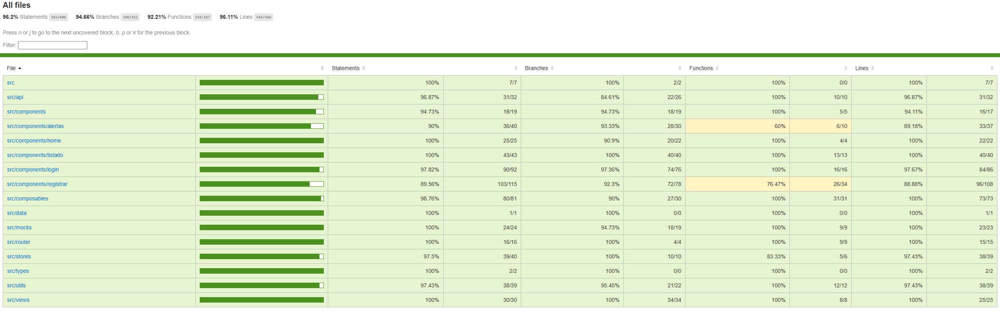

🧪 DOCUMENTACIÓN TÉCNICA – PRUEBAS FRONTEND
🚀 Estado Final
🧭 1️⃣ Rama de trabajo

Rama utilizada:
test/frontend-max-coverage

🎯 Objetivo

Maximizar cobertura y estabilidad del frontend sin afectar el desarrollo funcional del equipo.

Se trabajó en rama aislada para:

Incrementar cobertura global.

Asegurar estabilidad de componentes críticos.

Validar flujos reales.

Integrar pruebas E2E.

Garantizar cumplimiento del requisito ≥ 75%.

Una vez verificado que todo ejecutaba correctamente, los cambios fueron integrados en dev.

🛠 2️⃣ Stack de testing utilizado
🔬 Unit & Integration

Vitest → Unit testing

Testing Library → Testing basado en comportamiento real

Mocking controlado de API

Coverage con provider V8

🌐 End-to-End

Playwright / Cypress

Ejecución sobre entorno real

🧠 3️⃣ Estrategia de pruebas
🧩 Unit Tests

Cobertura aplicada sobre:

Componentes individuales

Stores (estado y acciones)

Utilidades

Router

API layer

Se validan:

✔ Renderizado correcto

✔ Props

✔ Eventos

✔ Estados condicionales

✔ Manejo de errores

✔ Validaciones de formularios

✔ Ramas condicionales (if / else)

🔁 Tests de integración

Pruebas que validan interacción real entre módulos:

Navegación entre rutas

Interacción componente + store

Flujo completo de formularios

Estados asíncronos

Renderizado condicionado por datos

🌐 Tests End-to-End (E2E)

Flujos críticos cubiertos:

Login

Registro

Creación de residuo

Visualización en listado

Navegación principal

Se ejecutan contra entorno real (sin mocks internos).

📊 4️⃣ Medición de cobertura

Comando utilizado:

npm run test:coverage

### 📸 Reporte visual de cobertura

📈 Resultados finales

Statements: 96.2%

Branches: 94.66%

Functions: 92.21%

Lines: 96.11%

✔ Supera ampliamente el requisito mínimo (75%)
✔ Cobertura estable y reproducible

🧱 5️⃣ Buenas prácticas aplicadas

Separación clara de responsabilidades.

Mocking controlado de dependencias.

Tests independientes y deterministas.

No dependencia de backend real para unit tests.

E2E aislado.

Código limpio y mantenible.

Cobertura real (no artificial).

🛡 6️⃣ Garantía de estabilidad

Se validó ejecución en entorno limpio:

npm ci
npm run test
npm run test:coverage
npm run e2e

→ Ejecutan sin errores.
→ Cobertura consistente.
→ Flujos críticos funcionales.

✅ Conclusión

El frontend cuenta con:

Pruebas unitarias

Pruebas de integración

Pruebas end-to-end

Cobertura superior al 90%

Ejecución reproducible

Esto garantiza estabilidad ante cambios futuros y minimiza riesgo de regresiones.